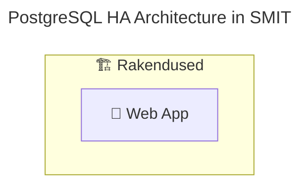

# Mermaid Diagram Standards

## Diagram Title and Structure

- **ALWAYS** include diagram title using `---` syntax
- Use descriptive titles that explain the diagram purpose
- Use meaningful node IDs and labels



## Visual Style Guidelines

### Color Scheme and Fills

- **PREFER** transparent backgrounds (`fill:none`) for clean look
- Use colored borders (`stroke:#color`) to differentiate component types
- Reserve light background fills only for special groupings that need emphasis

### Text and Readability

- Avoid forcing text color; let Mermaid/theme handle text where possible
- Prefer light fills for nodes/containers (`fill:#f8f9fa`) for readability across themes
- When using colored fills, explicitly set dark text color for contrast (`color:#111111`)
- Avoid dark background fills
- Test readability in both dark editors and white Confluence exports

### Border Styles

Use **different stroke widths** to show importance hierarchy:

| Width | Usage |
|-------|-------|
| `stroke-width:3px` | Critical components (VIP, main services) |
| `stroke-width:2px` | Standard components |
| `stroke-width:1px` | Supporting elements (networks, containers) |

Use **consistent colors** for similar component types:

| Color | Usage |
|-------|-------|
| Blue `#01579b` | Infrastructure/VMs |
| Red `#c92a2a` | Database services |
| Green `#20a39e` | Networking/proxies |
| Purple `#8c7ae6` | Coordination services |
| Yellow `#ffcc02` | Management tools |

## Icons and Emojis

**ALWAYS** use emojis with consistent mapping:

| Emoji | Component Type |
|-------|---------------|
| 🏗️ | Applications/Systems |
| 🖥️ | Virtual Machines |
| 🗄️ | Databases |
| ⚖️ | Load Balancers/VIPs |
| 🔗 | Proxies/Connections |
| 🤖 | Automation/Management |
| 🔧 | Tools/Utilities |
| 🌐 | Networks/VLANs |
| 🏢 | Data Centers/Locations |
| 💾 | Storage/Data |
| 📱 | User Applications |

## Node Naming and Labels

- Include **hostnames, ports, and versions** where relevant
- Use **generic placeholders** for examples (`mskXX`, `mskXXX`)
- **Follow UML stereotypes** using `«stereotype»` notation

```mermaid
PostgreSQL1["🗄️ «database server»<br/>PostgreSQL 15<br/>pg-mskXX-k8s-1.smit.dev<br/>Port 5432"]
```

## Subgraph Organization

- Give subgraphs **descriptive names** with emojis
- **Use direction directives** (`direction TB`) for better layout control
- **Include spacer elements** to ensure adequate container height
- **Prioritize vertical layout** (top-to-bottom) over horizontal for better page fitting
- **Avoid horizontal sprawl** — keep diagrams compact horizontally

```mermaid
subgraph DC1["🏢 «data center»<br/>DC1 - Data Center 1"]
    direction TB
    subgraph VM1["🖥️ «virtual machine»<br/>OEL 8 Virtual Machine<br/>pg-mskXX-k8s-1.smit.dev"]
        direction TB
        VM1_Spacer1[" "]
        PostgreSQL1["🗄️ «database server»<br/>PostgreSQL 15"]
        VM1_Spacer2[" "]
    end
    DC1_Spacer[" "]
end

%% Hide spacer elements
classDef spacer fill:none,stroke:none,color:transparent
class VM1_Spacer1,VM1_Spacer2,DC1_Spacer spacer
```

## Connection Types

- **Solid arrows** (`-->`) for primary data flow
- **Dotted arrows** (`-.->`) for replication, backup, or secondary connections
- **Label relationships** using `|"«relationship»"|` notation
- **Comments** using `%%` to group related connections

```mermaid
%% Primary data flow
Apps --> VIP
%% Replication relationship
PostgreSQL1 -.->|"«replication»"| PostgreSQL2
%% Management relationship
Patroni1 -->|"«manages»"| PostgreSQL1
```

## Class Definitions

- Define **all styling classes** at the end of the diagram
- Apply classes systematically to all relevant nodes

```mermaid
classDef vm fill:#f8f9fa,stroke:#01579b,stroke-width:2px
classDef pg fill:#f8f9fa,stroke:#c92a2a,stroke-width:3px
classDef app fill:#f8f9fa,stroke:#495057,stroke-width:2px

class VM1,VM2 vm
class PostgreSQL1,PostgreSQL2 pg
class App1,App2,App3 app
```

### Colored Component Palettes (recommended)

Use light pastel fills with dark text color for contrast in both themes:

```mermaid
classDef web fill:#e3f2fd,stroke:#01579b,stroke-width:2px,color:#111111
classDef api fill:#e8f5e9,stroke:#2e7d32,stroke-width:2px,color:#111111
classDef db  fill:#fff3e0,stroke:#ef6c00,stroke-width:3px,color:#111111
classDef queue fill:#f3e5f5,stroke:#6a1b9a,stroke-width:2px,color:#111111
```

### Cross-theme Safety

For diagrams with many unclassified nodes, set a light default fill:

```mermaid
classDef default fill:#f8f9fa
```

## UML Standards Integration

### UML Stereotypes

| Stereotype | Usage |
|-----------|-------|
| `«application tier»` | Application layer groupings |
| `«web»` | Web applications |
| `«api»` | API services |
| `«service»` | Background services |
| `«load balancer»` | Load balancing components |
| `«database server»` | Database engines |
| `«connection pooler»` | Database connection pools |
| `«cluster manager»` | Cluster management services |
| `«distributed store»` | Distributed storage systems |
| `«virtual machine»` | Virtual machine instances |
| `«data center»` | Data center locations |
| `«network»` | Network segments |
| `«schema»` | Database schemas |

### UML Relationship Labels

| Label | Usage |
|-------|-------|
| `«manages»` | Management relationships |
| `«replication»` | Data replication |
| `«deployed on»` | Deployment relationships |
| `«depends on»` | Dependency relationships |
| `«uses»` | Usage relationships |
| `«inherits»` | Inheritance relationships |

## Critical Rules

- **ALWAYS** include a `---` title block and use descriptive titles
- **ALWAYS** use emojis consistently per the mapping above
- **ALWAYS** define classDef styles at the end and apply them to all nodes
- **ALWAYS** use UML `«stereotype»` notation for component identification
- **PREFER** vertical (TB) layout over horizontal to fit documentation pages
- **PREFER** light fills (`fill:#f8f9fa`) or `fill:none` with colored strokes
- **NEVER** use bright/dark background fills that harm readability
- **NEVER** use generic node names (A, B, C) without descriptive labels
- Use generic hostnames (`mskXX`) in examples, not specific numbers
